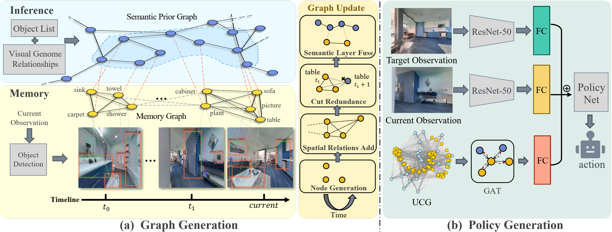

# Visual Navigation for Embodied Agents Using Semantic-based Multi-modal Cognitive Graph

Accepted for publication in the IEEE Transactions on Image Processing (T-IP)



## Abstract

We propose a semantic-based multi-modal cognitive graph, termed **SMCG**, for intelligent visual navigation. 
SMCG provides a unified semantic-level representation of **memory** and **reasoning**, where memory is constructed by recording sequences of observed objects instead of raw perceptual features, and reasoning is performed over a semantic relation graph encoding object correlations. 
To effectively exploit the heterogeneous cognitive information, we further design a **Hierarchical Cognition Extraction (HCE)** pipeline to decode both global cognitive cues and situation-aware subgraphs for navigation decision-making. 
The proposed framework enables embodied agents to exhibit more informed and proactive navigation behaviors. 
Experimental results on image-goal navigation tasks in photorealistic environments demonstrate that SMCG significantly improves navigation success rate and path efficiency compared with existing methods.


## Prequisites

### System

* Python **3.8+**
* PyTorch (CUDA recommended)
* NVIDIA GPU with CUDA support (optional but strongly recommended)

```bash
pip install -r requirements.txt
```

### Simulator

* `habitat==0.2.1`
* `habitat-sim==0.2.1`


Install **Detectron2** following the official guide (must match PyTorch/CUDA version).


### Pretrained Models and Data

* `yolov3/best.pt` (object detector)
* `RetrievalNet/best.pth` (retrieval / feature backbone)
* `detectron/model/model_final_280758.pkl`


## Usage

### Datasets

We use expert demonstration data collected in the **Habitat-Gibson** simulator for image-goal visual navigation.  
The dataset contains panoramic RGB-D observations and expert trajectories, and is organized as follows:

```

IL_data
├── train
│   ├── easy
│   │   ├── Anaheim_000_env0.dat.gz
│   │   ├── ...
│   ├── medium
│   └── hard
└── test
│   ├── easy
│   ├── ...

```

Each `.dat.gz` file corresponds to one navigation episode in a Gibson scene.  
Difficulty splits are defined by the start-to-goal distance: easy (1.5–3 m), medium (3–5 m), and hard (5–10 m).


### Training

```bash
python main.py \
  --config ./configs/vgm.yaml \
  --data-dir <path_to_demos> \
  --gpu 0
```

* Logs and checkpoints are saved under `record/<date>/`
* Hyperparameters, dataset splits, and evaluation cadence are defined in `configs/`
* Semantic memory and reasoning graph construction is implemented in `graph.py`


### Evaluation

```bash
python evaluator.py --model_path <checkpoint_path>
```

With visualization:

```bash
python evaluator.py --model_path <checkpoint_path> --visualize
```

Our pretrained model can be found through the following link:

```
link: https://pan.sjtu.edu.cn/web/share/e5c9c14123952434cb3494f30694165f, 
password: hgxf
```

## Acknowledgments

This work builds upon the following open-source projects:

* [Habitat](https://aihabitat.org/)
* [Detectron2](https://github.com/facebookresearch/detectron2)
* [YOLOv3](https://github.com/ultralytics/yolov3)

We thank the reviewers of *IEEE Transactions on Image Processing* for their constructive feedback.

## Citation

If you find this work useful in your research, please consider citing:

```bibtex
@ARTICLE{SMCG2025,
  author={Liu, Qiming and Du, Xinmin and Liu, Zhe and Wang, Hesheng},
  journal={IEEE Transactions on Image Processing}, 
  title={Visual Navigation for Embodied Agents Using Semantic-Based Multi-Modal Cognitive Graph}, 
  year={2025},
  volume={34},
  number={},
  pages={7989-8001},
  keywords={Cognition;Semantics;Navigation;Decision making;Visualization;Data mining;Pipelines;TV;Probabilistic logic;Organisms;Visual navigation;embodied agents;cognitive ability;memory;reasoning},
  doi={10.1109/TIP.2025.3637722}}
```